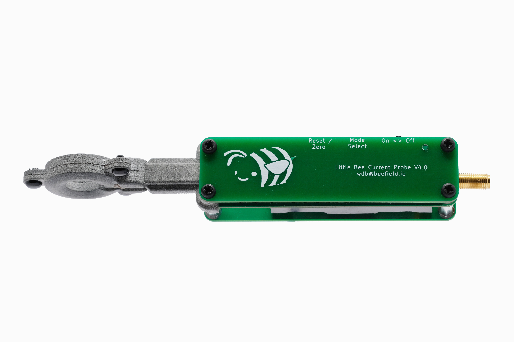
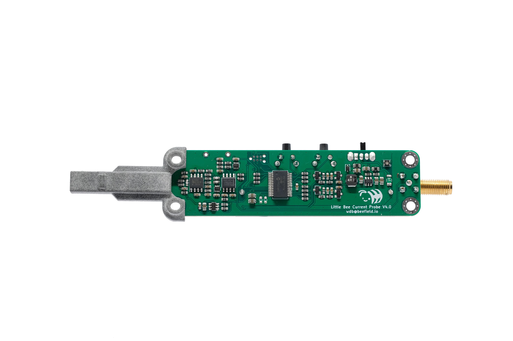
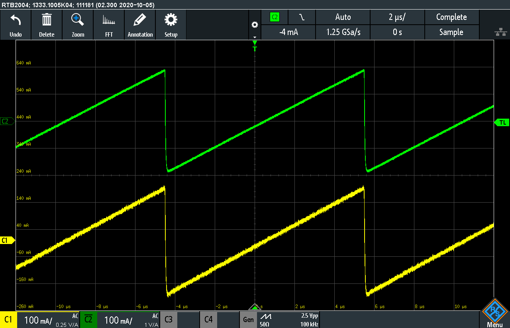
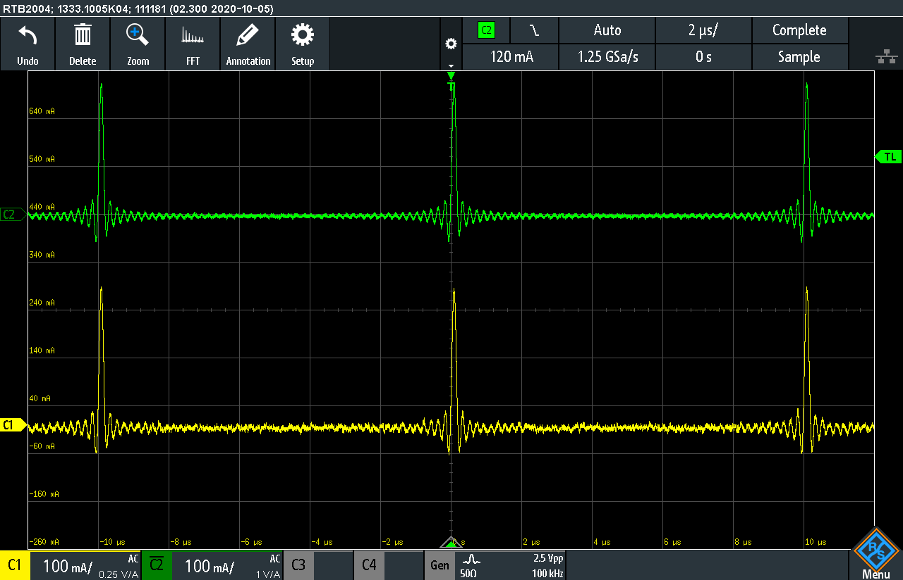
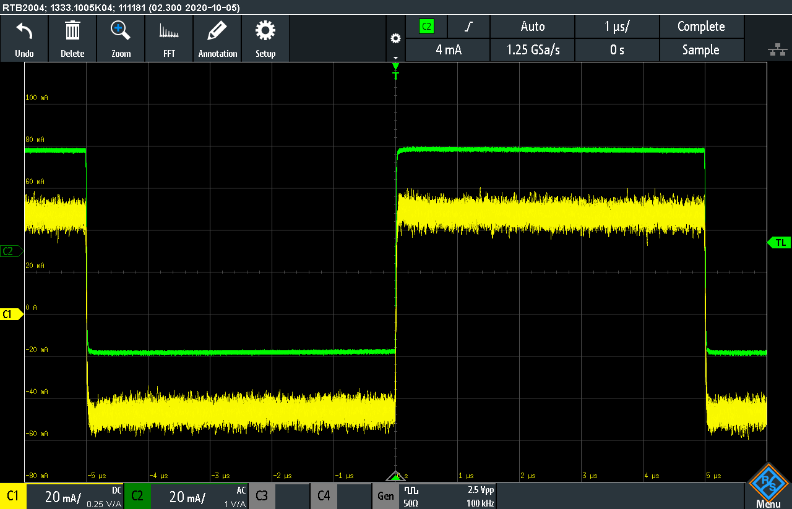
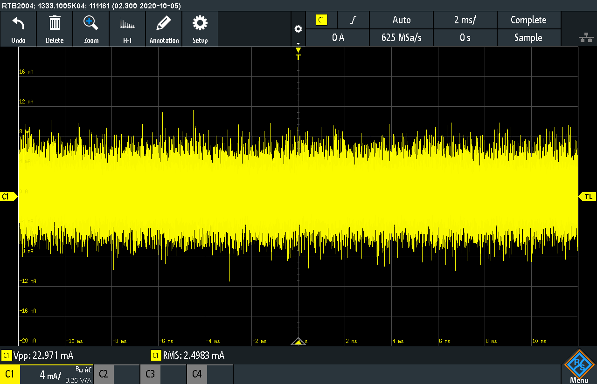

# Little Bee B1 - A high performance current & magnetic field probe
**Operating Instructions are located in the [getting-started](getting-started/README.md) folder**

The Little Bee B1 is an open source magnetic field and current probe based on an Anisotropic Magneto-Resistive (AMR) magnetic sensor.
It directly senses magnetic fields and measures current with a current sensing attachment consisting of a gapped ferrite toroid that is placed around a wire, establishing a fixed relation between the current in the wire and magnetic field the sensor is subject to.

The probe is capable of sensing DC currents and has a high frequency -3dB bandwidth in excess of 10Mhz. Typical specifications for current sensing are a +/- 5A range, and a 3mA RMS noise floor. For magnetic field sensing the probe has a +/- 6 gauss range. It is compatible with any 1M ohm input oscilloscope and is powered by a single AA battery. The probe uses a PIC microcontroller to automatically zero the sensor and to provide adjustable gain and bandwidth.

All project source files are in this repository and the project currently has a CrowdSupply [campaign](https://www.crowdsupply.com/weston-braun/little-bee)
 

### Typical Electrical Performance

#### Current sensing

- **Bandwidth**: DC - 10 MHz
- **Sensitivity**: 0.25 Volts/Amp
- **Max Current**: +/- 5 A
- **Noise**
    - 3 mA RMS at 10 MHz bandwidth
    - 2 mA RMS at 1 MHz bandwidth
- **DC Accuracy**: +/- 15%
- **Insertion Impedance**: 100 nH in parallel with 70 Ohms

#### Magnetic Field Sensing

- **Bandwidth**: DC - 10 MHz
- **Sensitivity**: 0.2 Volts/Gauss
- **Max Field**: +/- 6 Gauss
- **Noise**
    - 4mG RMS at 10 MHz bandwidth
    - 2.5mG RMS at 1 MHz bandwidth

## Operation
Connect the Little Bee to any oscilloscope with a SMA-BNC cable. When the probe is powered on it automatically zeros and starts in the high bandwidth and low gain mode. Tapping the "Mode Select" button will cycle through the bandwidth and gain options, which are indicated by the LED color.

The probe should be re-zeroed after switching modes. This is accomplished by pressing and holding the "zero/reset" button for at least one second before releasing. The LED will blink once when the button is first pressed and a second time when the zeroing operation is done.

When the sensor is exposed to an excessive magnetic field, or excessive current when the current sensing attachment is used, the sensor will be demagnetized and need to be reset for normal operation. For on axis fields the probe can detect this and will turn the indicator light red.
Off axis fields, which can occur when the probe is used for magnetic field sensing, can exceed the sensor limit without being detected. This will result a loss of sensitivity and noticeable distortion in the sensed waveforms.  
The sensor can be reset and normal operation restored without impacting the zeroing of the probe by tapping the "zero/reset" button, which will briefly flash the indicator light.

If the probe senses a low battery that will inhibit normal operation the indicator light will flash red. An alkaline AA battery should provide around 4 hours of battery life.

### Current Sensing
Current sensing is achieved with the current sensing attachment, which clips on to the tip of the probe. The current sensing attachment uses a ferrite core to translate the current flowing in to a wire into a known magnetic field strength.
A wire can be threaded through the current sensing attachment or the current sensing attachment can be slipped over a wire before being clipped on. With the logo and writing on the Little Bee facing the user, a wire carrying current away from the user will be read as a positive current.

The location of the wire within the current sensing attachment has some impact on the sensitivity of the probe due to the magnetic field in generates. It is recommended to keep the wire on the opposite side of the sensing tip within the aperture of the current sensing attachment.

For higher resolution when measuring low currents, multiple turns of the wire can be made through the aperture of the current sensing attachment. The final sensitivity will be the set sensitivity times the number of turns.

Tapping the "Mode Select" button will cycle through the bandwidth and gain options, which are indicated by the LED color:

| LED Color | Mode                    |
|-----------|-------------------------|
| Green     | 10MHz bandwidth 0.25V/A |
| Yellow    | 1MHz bandwidth 0.25V/A  |
| Blue      | 10MHz bandwidth 1V/A    |
| Teal      | 1MHz Bandwidth 1V/A     |

The gain of the probe can be adjusted with the labeled trimmer resistor on the PCB. Units are shipped calibrated to the above gains.

### Magnetic Field Sensing
The magnetic sensor is located approximately 1.0mm offset from the tip of the probe. The Little Bee will measure a magnetic field entering perpendicular to the top of the probe as a positive voltage. To measure the magnetic field emitted by a PCB trace the probe should be placed perpendicular to the PCB with the long direction of the tip parallel to the trace.

The earth's magnetic field is typically between 0.3 - 0.6 Gauss, depending on geographic location. This is well within the sensing range of the probe. Additionally, large ferrous objects and transformers can emit stray magnetic fields. It is recommended the Little Bee is zeroed while holding it in the orientation used for taking measurements to reduce the error introduced by stray magnetic fields.

The gain of the probe is calibrated based on measurements with the current sensing attachment, so the true sensitivity will depend on the tolerance current sensing attachment. The nominal sensitivities are:

| LED Color | Mode                           |
|-----------|--------------------------------|
| Green     | 10MHz bandwidth 0.2 V/Gauss  |
| Yellow    | 1MHz bandwidth 0.2 V/Gauss   |
| Blue      | 10MHz bandwidth 0.8 V/Gauss  |
| Teal      | 1MHz Bandwidth 0.8 V/Gauss   |

## Hardware
The kicad PCB files are in the [PCB](pcb/) directory and the [schematic](doc/current-sense.pdf) is in the doc directory.

## Firmware
The Little Bee uses a PIC16 microcontroller to automatically zero the probe and control gain and bandwidth switching. The firmware is built with the
MPLAB X IDE and the complete project is in the [firmware](firmware) directory

## Open Source
This work is licensed under a
[Creative Commons Attribution-ShareAlike 4.0 International License][cc-by-sa].

[![CC BY-SA 4.0][cc-by-sa-image]][cc-by-sa]

[cc-by-sa]: http://creativecommons.org/licenses/by-sa/4.0/
[cc-by-sa-image]: https://licensebuttons.net/l/by-sa/4.0/88x31.png
[cc-by-sa-shield]: https://img.shields.io/badge/License-CC%20BY--SA%204.0-lightgrey.svg

## Demos
### Sensing the AC line current into a switch-mode power supply

### Sensing the magnetic field from an inductor

### Example Waveforms
Yellow Waveform: Little Bee B1

Green Waveform: Tektronix CT-2 Current Transformer
#### Ramp

#### SinC

#### Square Wave (Low Current)

#### Noise Floor

