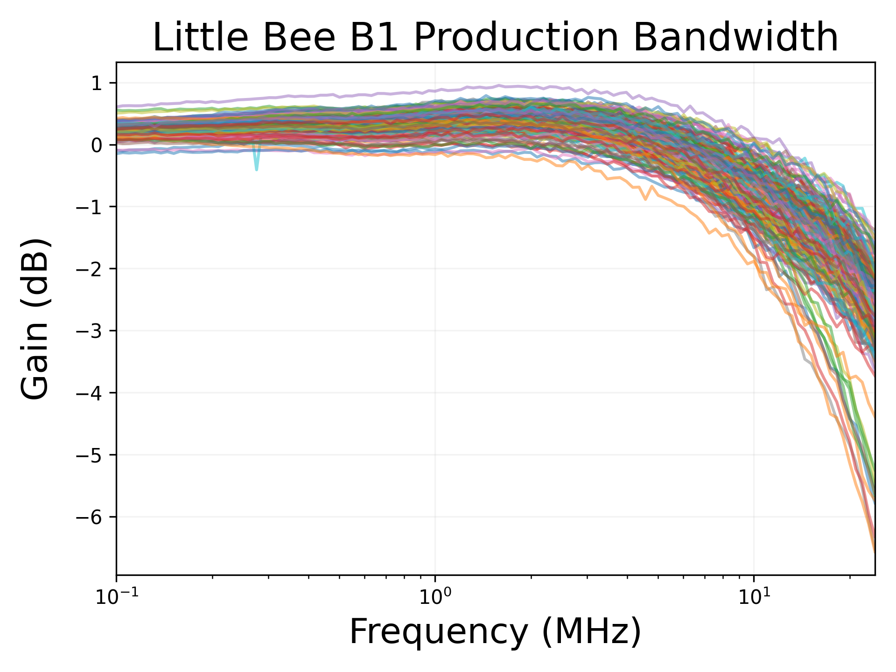
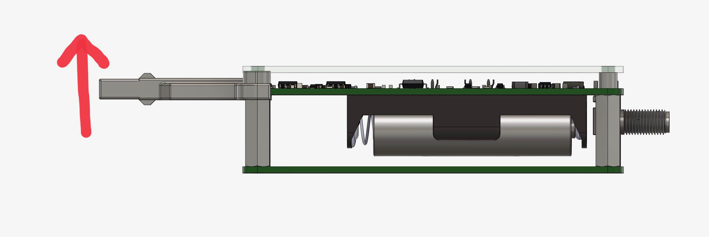

# Little Bee B1 Operating Instructions

## Introduction
The Little Bee is a current and magnetic field probe using an Anisotropic Magneto-Resistive (AMR) magnetic sensor.
Current in a wire can accurately be sensed in a wire with the current sensing attachment.
Without the attachment the Little Bee can be used to directly measure magnetic fields. In the context of circuit debugging this can be used to measure the current waveforms in PCB traces and inductors.  
The Little Bee is powered by a AA battery, with an expected battery life of 4 hours, and connects to any oscilloscope with a 1M Ohm input with a SMA to BNC cable.
The Little Bee has auto zeroing functionality and 4 different gain and bandwidth modes.

## Typical Electrical Performance
All Little Bee units are serialized and the frequency response is characterized in production for the low gain and 10MHz bandwidth mode.
Production data is in the [test-data](../production/test-data) folder in this repo.
Below is a plot of all of the production data.
The outliers are from early production where gain was adjusted after characterization and there was a 20MHz bandwidth limit enabled on the test oscilloscope.

#### Current sensing

- **Bandwidth**: DC - 10 MHz
- **Sensitivity**: 0.25 Volts/Amp at low gain, 1.00 Volts/Amp at high gain
- **Max Current**: +/- 5 A at low gain, +/- 1.5 A at high gain
- **Noise**
    - 3 mA RMS at 10 MHz bandwidth
    - 2 mA RMS at 1 MHz bandwidth
- **DC Accuracy**: +/- 15%
- **Insertion Impedance**: 100 nH in parallel with 70 Ohms

#### Magnetic Field Sensing

- **Bandwidth**: DC - 10 MHz
- **Sensitivity**: 0.2 Volts/Gauss at low gain, 0.8 Volts/Gauss at high gain
- **Max Field**: +/- 6 Gauss at low gain, +/- 1.8 Gauss at high gain
- **Noise**
    - 4mG RMS at 10 MHz bandwidth
    - 2.5mG RMS at 1 MHz bandwidth

## Operation
### Start Up
When the Little Bee is powered on it will initialize in the low gain and high bandwidth mode and immediately enter the auto-zero routine.
The auto-zero routine takes 3.5 seconds and the LED will blink once when auto-zeroing is finished.
During this period the Little Bee will not respond to repeated button presses.
Once the auto-zero routine is done the Little Bee is ready to use.
The two buttons "Reset/Zero" and "Mode Select" are used to control the functionality of the Little Bee and the color of the status LED is used to indicate the probe status and operating mode.
By holding both buttons down before power is switched on the Little Bee will start up in an absolute field sensing mode until power is cycled.

### Reset and Zero
The "Reset/Zero" button can be used to reset the sensor after exposure to a high magnetic field or to zero the probe in order to remove impacts from ambient magnetic fields for improved accuracy when measuring low currents or magnetic fields.
Tapping the "Reset/Zero" button will reset the sensor.
When the sensor is reset the status LED will flash off and on twice in quick succession.
If the status LED was previously red due to the requirement for a sensor reset, the status LED will return to the normal color after reset.
Resetting the Little Bee sensor has no impact on the zeroing.  

If the "Reset/Zero" button is held for more than 1 second the probe will enter the auto-zero routine, which takes 2 to 4 seconds.
The LED will flash off and on once at the start of the auto-zero routine and once after the auto-zero routine is finished.

Rarely, the auto-zero routine is unable to zero the output due to high ambient magnetic fields.
When this happens the status LED will blink red at the end of the auto-zeroing routine.

### Mode Select
Pressing the "Mode Select" button cycles the Little Bee through the 4 gain and bandwidth modes.
The current mode is indicated by the color of the status LED.
The status LED will cycle in the order of  \[Green, Yellow, Blue, Teal\]  with each press of the "Mode Select" button.

### Status LED
The status LED is used to indicate the gain and bandwidth setting of the Little Bee as well as to indicate error conditions.
The below table details the meaning of each status LED color.

| Status LED Color | Mode                    |
|-----------|-------------------------|
| Green     | 10MHz bandwidth 0.25V/A or 0.2 V/Gauss |
| Yellow    | 1MHz bandwidth 0.25V/A or 0.2 V/Gauss |
| Blue      | 10MHz bandwidth 1V/A or 0.8 V/Gauss   |
| Teal      | 1MHz Bandwidth 1V/A or 0.8 V/Gauss    |
| Red       | Sensor Reset Required |
| Flashing Red | Low Battery |
| Purple | Absolute Field Sensing Mode |

### Current Sensing

The Little Bee is used for current sensing mode by clipping the included current sensing attachment on to the detents on the probe tip and passing a wire though the hole in the current sensing attachment.
To reduce mechanical strain it is recommended to hold the Little Bee by the plastic tip cover when clipping on the current sensing attachment.

The electrical operation of the Little Bee is the same between current sensing and field sensing, the current sensing attachment merely establishes a fixed relationship between the current flowing in the wire and the magnetic field the sensor is exposed to.
The direction of current flow in a wire for a positive output voltage is indicated on the top of the Little Bee.

The location of the wire within the current sensing attachment may cause minor changes in the gain of the probe.
For maximal accuracy it is recommended to prevent the wire from being directly adjacent to the probe tip and instead keep it centered in the middle or at the far end of the current sensing attachment.
When measuring small currents, multiple turns of wire may be made through the center of the current sensing attachment to increase the response.
The current measured by the Little Bee will be the current flowing through the wire multiplied by the number of turns.

The current sensing attachment may have a residual magnetic field and only reduces, but does not eliminate, the influences of external magnetic fields.
To maximize accuracy it is recommended to zero the Little Bee after clipping the current sensing attachment on and placing the Little Bee as part of the test setup.

The magnetic domains in the AMR sensor used in the Little Bee can be mis-aligned by large magnetic fields, leading to incorrect output until the sensor is reset.
With the current sensing attachment, the majority of the magnetic field will be on the sensitive axis of the sensor, which allows the Little Bee to detect this overload condition.
At currents above 6 amps the status LED will turn red, indicating the need for a sensor reset.

### Magnetic Field Sensing

Without the current sensing attachment the Little Bee can be used to directly sense magnetic fields.
Useful applications for this include tracing currents in PCB traces and measuring inductor current waveforms through leakage magnetic fields.
The magnetic field direction for a positive output voltage is marked on the top of the Little Bee and shown below for convenience.

This direction means that for checking the current in a PCB trace the body of the Little Bee should be held perpendicular to the PCB with the longer side of the probe tip parallel to the PCB trace.
If trying to measure the current in a PCB trace it is recommended to first calibrate your measurements with a known current flowing through a PCB trace, but for typical PCB geometries the Little Bee response will be around 0.2V/A when the probe is in low gain mode.

Due to the small magnetic fields generated by PCB traces carrying even modest currents, measurements are susceptible to ambient magnetic fields, with the magnetic field strength of the earth being a large contributor.
It is recommended that measurements be taken away from any large iron transformers, motors, or fans, and the Little Bee first be zeroed while being held a few inches above the PCB in the orientation that will be used for probing.

Another difficulty in taking magnetic field measurements is saturating the sensor with excessive magnetic fields.
The sensor can be overloaded, corrupting the output until it is reset, by magnetic fields that are not on the sensitive axis.
This means that, unlike with current sensing, the Little Bee can not always detect when the sensor has been overloaded and requires a reset.
For applications where the magnetic field may be large and it is not necessarily clear what the magnetic field direction is, such as sensing the leakage magnetic fields of inductors and transformers, it is recommended to keep the Little Bee as far back as possible while still getting good readings and to reset the sensor often.

### Absolute Field Sensing Mode  
The absolute field sensing mode is mostly a novelty and debug tool that was added in late development.
If both buttons are held down when the Little Bee is turned on the system will enter absolute field sensing mode until power is cycled and the status LED will turn purple.
In this mode all further button inputs are ignored until power is cycled.

In this mode the sensor sensing polarity is flipped at 55Hz by re-aligning the magnetic domains using the reset circuitry.
This effectively performs signal mixing with the sensor input and a 55Hz signal.
This shifts the sensor DC magnetic field reading to 55Hz while all system offsets stay at DC, allowing the value of the absolute magnetic field strength to be measured as a peak to peak AC value.
This can be used for checking ambient magnetic field strengths, which would otherwise be zeroed out by the probe.
Additionally, with added digital signal processing, this mode can allow for the Little Bee to measure very small magnetic fields.

## Safety
The Little Bee B1 is not CAT rated.
Do not use the Little Bee on un-insulated wires.
The Little Bee is designed for use in a laboratory environment. 

## Improvements
### External Power
Based on user feedback to power the Little Bee with something other than a AA battery, there is an unpopulated footprint for a 2 pin JST-XH connector (part number B2B-XH-A(LF)(SN)).
Through this footprint up to 4.5 volts can be supplied, such as an lithium-ion battery.
If an external power adapter is used it must be low noise and isolated; the SMA ground terminal on the Little Bee is not directly referenced to the negative pin on this terminal.

### Mechanical Case
STL files for a user printable mechanical case for the Little Bee are under development.  
